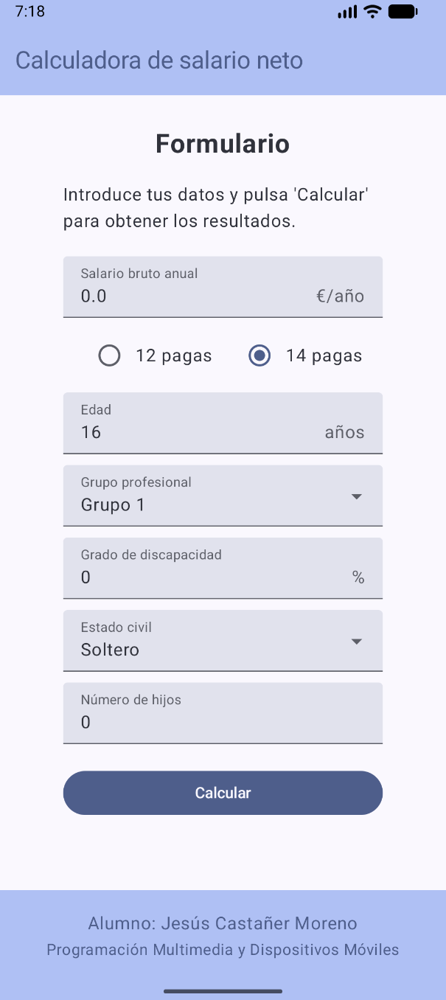
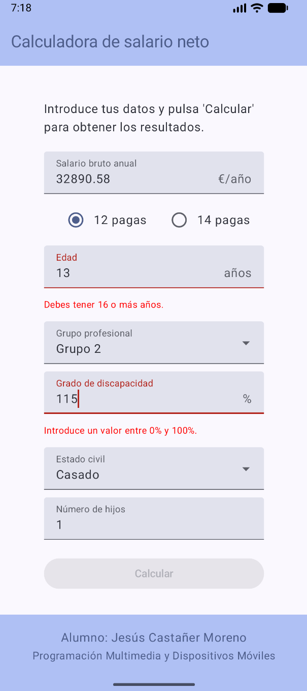
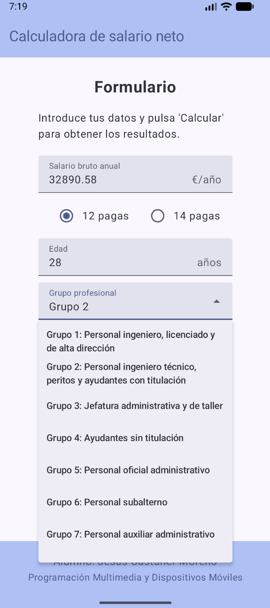

# Calculadora de salario neto

Aplicación para Android que permite calcular fácilmente el salario neto de un trabajador, junto con
su cotización a la Seguridad Social, su retención de IRPF y las deducciones
que le sean aplicables.

La aplicación ha sido desarrollada en Android Studio con Kotlin y Jetpack Compose.

## Funcionamiento

El usuario debe introducir en la vista de Formulario los valores necesarios para hacer los cálculos.

Si algún valor introducido es inválido (p. ej., una edad negativa), aparecerá un mensaje de error en
color rojo. El botón `Calcular` permanecerá desactivado mientras alguno de los campos contenga un
valor inválido.

Algunos campos son menús desplegables.

Al pulsar en el botón `Calcular`, los valores son enviados a la Calculadora, donde se realizan los
cálculos necesarios. Después, los resultados se muestran en la vista de Resultados:

